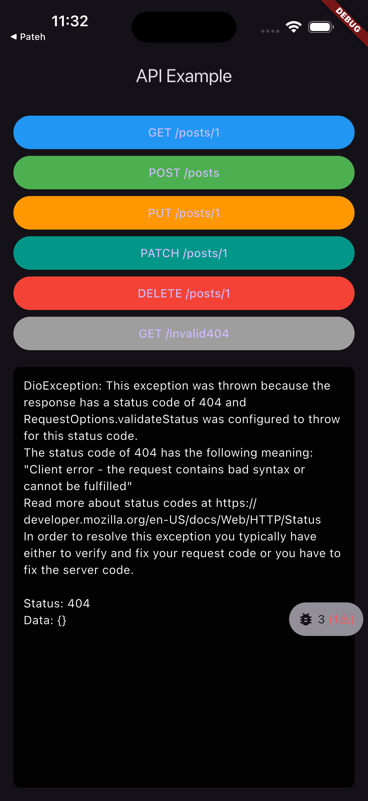
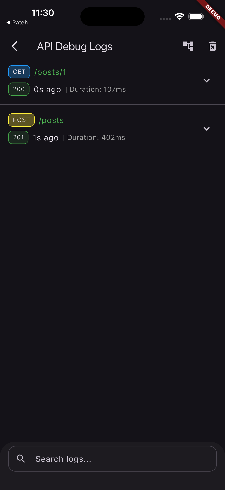
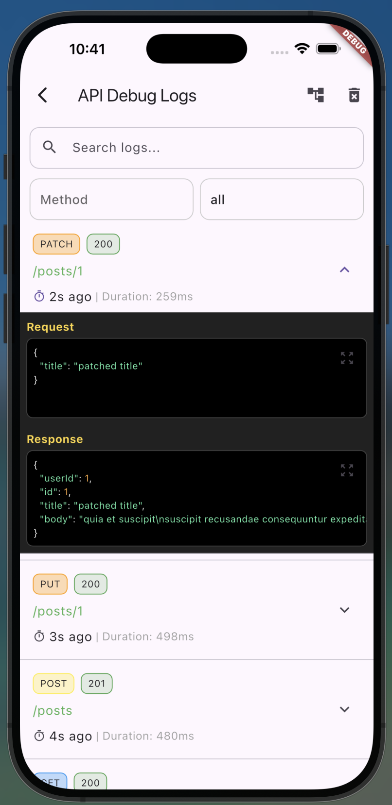

# 🛰️ API Sentinel

**A structured, developer-friendly networking and debugging layer for Flutter.**  
`api_sentinel` provides a clean and consistent way to handle API requests, error mapping, and runtime debugging through an on-screen overlay.

---

## ✨ Features

✅ Unified API call interface via `ApiService.instance.request()`  
✅ Customizable callbacks for success, Dio exceptions, and general exceptions  
✅ Centralized error handling and message parsing  
✅ Floating on-screen debug overlay to visualize requests  
✅ Built with `dio` and `get` (GetX) for lightweight reactivity  
✅ Supports Android, iOS, and Web

---

## 📦 Installation

Add this line to your `pubspec.yaml`:

```yaml
dependencies:
  api_sentinel: ^0.0.4
````

Then run:

```bash
flutter pub get
```

---

## 🧠 Architecture Overview

The library is built around three core layers:

| Layer            | Description                                                                             |
| ---------------- | --------------------------------------------------------------------------------------- |
| **ApiService**   | Handles all HTTP requests (GET, POST, PUT, PATCH, DELETE) through Dio.                  |
| **ErrorHandler** | Converts all errors (network, timeout, response, etc.) into readable `Failure` objects. |
| **DebugOverlay** | Shows all ongoing and past requests on top of your UI during runtime (toggleable).      |

---

## ⚙️ Usage

### 1️⃣ Initialize the Service

```dart
final api = ApiService(baseUrl: 'YOUR_BASE_URL');
```

---

### 2️⃣ Make a Request

Each request is wrapped with `ApiService.instance.request()`
This ensures that error handling, logging, and overlay integration all happen automatically.

```dart
await ApiService.instance.request(
  method: HttpMethod.get,
  url: 'SOME_REQUEST',
  onSuccess: (response) {
    print('✅ Success: ${response.data}');
  },
  onCatchDioException: (error) {
    print('❌ Dio Error: ${handleErrorMessage(error)}');
  },
  onCatchException: (error) {
    print('💥 Exception: ${handleErrorMessage(error)}');
  },
);
```

This pattern applies to **any HTTP method** — just change the `method` and `url`.

---

### 3️⃣ Supported HTTP Methods

You can use all standard HTTP verbs through the `HttpMethod` enum:

```dart
enum HttpMethod { get, post, put, patch, delete }
```

---

## 🧩 Error Architecture

| Error Type         | Source          | Failure Example             |
| ------------------ | --------------- | --------------------------- |
| Connection Timeout | Dio             | `(-1) Connection timed out` |
| Bad Request        | HTTP 400        | `Bad Request`               |
| Unauthorized       | HTTP 401        | `Unauthorized access`       |
| Forbidden          | HTTP 403        | `Access denied`             |
| Not Found          | HTTP 404        | `Resource not found`        |
| Server Error       | HTTP 500        | `Internal server error`     |
| Cancelled          | Dio CancelToken | `Request cancelled`         |
| Unknown            | Fallback        | `Something went wrong`      |

---

## 🧰 Debug Overlay


### 🧊 Floating Draggable Widget

A persistent, draggable button gives quick access to real-time logs.

```dart
Stack(
  children: [
    // Your main widget
    MyApp(), 
    // Your debug overlay button
    const DebugOverlayWidget(),
  ]
)
```

Inside, you’ll see:

* A real-time log list for each request
* Search and filter by method/status code
* Tap any log to expand request/response JSON
* Toggle between **Tree View** and **Pretty JSON**
* Click to **expand full-screen**

### 🌳 JSON Tree Viewer

Displays structured hierarchical JSON for nested inspection.

### 🎨 Pretty JSON Viewer

Shows syntax-colored formatted JSON text.

### 🖥 Full-Screen View

Click the expand icon (🔍) in the corner to open the full JSON view for better readability.


Whenever your app performs an API call through `ApiService`, it will appear in a floating overlay with:

* Method type (GET/POST/PUT/PATCH/DELETE)
* Status code
* Response time
* Response preview


<p align="center">
  
  
  
</p>

---

## 🧪 Example Project

A complete example app is included under the [`example/`](./example) directory.

To run it:

```bash
cd example
flutter run
```

It includes a test page with colored buttons for:

* GET
* POST
* PUT
* PATCH
* DELETE
* 404 Error simulation

All using the `ApiService` and `DebugOverlay`.

---

## 📚 License

MIT License © 2025
Developed and maintained by [Aref Yazdkhasti](https://github.com/Arefyazdkhasti/api_senrinel)

---

## 💬 Contribution

Contributions are welcome!
If you’d like to improve the debugging UI, extend the `ErrorHandler`, or support additional APIs, open a PR or issue.

---

## 🧭 Future Plans

* [ ] Response caching layer
* [ ] Retry strategy for failed requests and 401 unauthenticated request
* [ ] Filterable API session logs

---

> **API Sentinel** — Because understanding your API should be as clear as your code.
